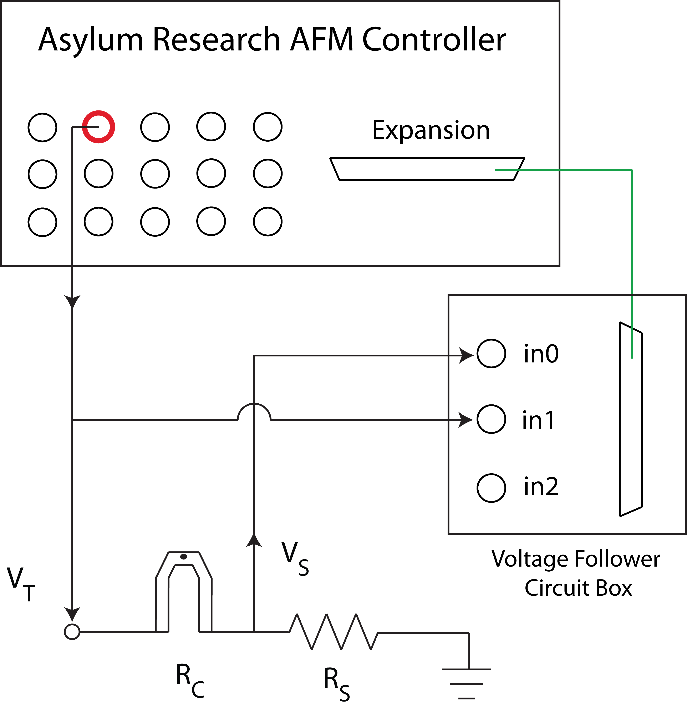
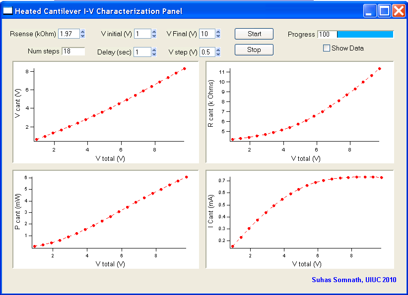
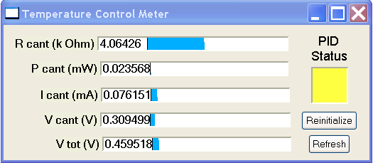
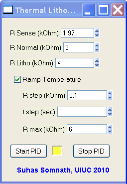
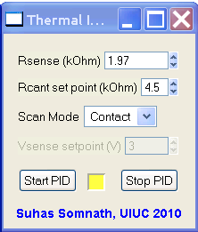

Heated Cantilever Suite
========================
**Suhas Somnath**

University of Illinois Urbana-Champaign

Last Updated: 3/01/2012

Introduction
-------------

This software suite provides the capability to perform experiments such
as thermal nanolithography and thermal topography imaging using heated
micro-cantilevers via the hardware and software of Asylum Research AFMs.
This software suite controls cantilever temperature in closed loop
feedback using the AFM controller’s electronics to improve lithography
and imaging performance of heated cantilevers.

Disclaimer:
~~~~~~~~~~~

This code is foreign to the existing AFM software. I have worked around
many issues painstakingly to ensure that this code works as smoothly as
possible. In the same manner, care has been taken to ensure that the
normal AFM operation is not thwarted in any way. Sometimes, when this
package is started up but not used actively, certain native operations
of the AFM software tend to take back certain resources that were
allocated for this code. This may manifest in the form of malfunctioning
temperature control meters, stoppage in the PID controlling the
cantilever temperature, etc. None of these should damage the cantilever
in anyway. To resume normal operation of this code when necessary, use
the reinitialize / refresh buttons provided. Typically, clicking on the
start button is sufficient to bring things back to normal. This code has
been tested extensively and its use has so far never resulted in any
damage to the cantilever or the sample but please be careful when using
this code and be mindful of the fact that this code is still foreign to
the native AFM software.

This software was written from 2009 - 2012 and I provide no guarantee / fixes for making it work today.

Requirements
------------

Software
~~~~~~~~~

* Igor Pro 6.1 or later
* Asylum Research software version: MFP3D 090909+xxxx or later

Hardware
~~~~~~~~~

* Asylum Research MFP-3D or Cypher AFM
* Voltage follower circuit breaker - only for AFM Controllers prior to ARC 2 (2011 Jan or before)
* Silicon Self-heating cantilevers from:

   * UIUC - Prof. William P. King or
   * Anasys Instruments - Thermalever AN200 / AN300 probes - sold commercially

Setup
-----

Electrical connections
~~~~~~~~~~~~~~~~~~~~~~~

Please make sure to use the voltage follower box specially constructed
to circumvent the impedance matching problem of older Asylum Research
AFM controllers for this code to work accurately.

|Schematic|

1. Connect the ``Expansion port`` (25 pin serial) on the ``AFM controller`` to
the ``Voltage follower box``

2. Connect V\ :sub:`S` (voltage across R\ :sub:`S`) to the ``in0`` labeled
on the voltage follower box

3. Connect V\ :sub:`T` to the in1 labeled on the voltage follower box
and to ``BNCout0`` on the AFM controller. You can use a ``BNC T-split`` for
this.

Software Installation
~~~~~~~~~~~~~~~~~~~~~
1. Copy the ``TemperatureControl.ipf`` file into the ``UserIncludes`` folder so that this procedure file is compiled after
   the AFM software.
2. Copy the hacks present in each Asylum source code file in the ``hooks`` folder to the corresponding file used by your AFM.

   * I have used comments with my name to delineate the start and ends of each hack
   * Search for ``Suhas`` to find each of the modifications
   * Modify your file accordingly.
3. Accessing the Heated Cantilever Suite: In the top ``menu bar`` of the AFM
   software: ``UIUC`` >> ``Heated Cantilever Suite`` >>

|image1|

Cantilever Electrical Characterization
---------------------------------------

|image2|

Introduction
~~~~~~~~~~~~~

-  This package is accessed by clicking on ``UIUC`` >> ``Heated Cantilever Suite`` >> ``I-V Characterization``.

-  This package lets you electrically characterize the probe by linearly
   ramping the voltage being applied across the heating circuit.

Parameters
~~~~~~~~~~~

-  ``R sense (k Ohm)``: The resistance of the sense resistor in ``kΩ``. You
   can apply at most ``10V`` with this setup so choose your sense resistor
   that will allow you to access the cantilever temperatures you are
   interested in. I advise you to pick sense resistors in the range of ``1``
   to ``5 kΩ``. The value entered here **will persist** throughout the AFM
   software.

-  ``V initial (V):`` Initial voltage to be applied across the circuit
   (0V <= ``V initial`` <10V). Lower ranges of voltage (0-1V) are typically
   less reliable. 1V should be just fine.

-  ``V final (V)``: Maximum voltage that will be applied across the
   circuit (0V < ``V final`` <= 10V). I advise you to start with something
   small like ``2V`` and go as high as necessary.

-  ``Delay (sec)``: Time delay in seconds between measurement points.
   Larger the delay, greater the number of points of data being
   averaged. Any time greater than 1 sec will not necessarily improve
   the accuracy of the results greatly. Ensure that the delay is at
   least ``250 msec``.

-  ``V step (V)``: Incremental voltage being applied across the circuit
   between measurement points.

-  ``Show data:`` If this is left checked, a table will pop up with the
   results of the IV characterization.

Running an Experiment
~~~~~~~~~~~~~~~~~~~~~~

-  Once the above parameters are specified, you may click the ‘Start’
   button. If it does nothing on the first click, click it again.

-  In the event that you want to stop the ramp at any time, you can do
   so by clicking the "Stop" button.

-  Four graphs are updated in real time as each measurement point is
   acquired. Due to the nature of Igor Pro, the data may appear in an
   awkward manner because Igor Pro considers (0,0) as a point of
   measurement even if it is a virtual point on the graph. This will
   disappear and the data will look the way it should once the ramp is
   completed.

-  The four graphs display circuit properties against actual bias
   applied across the circuit and are as follows in anti-clockwise
   direction:

   -  Cantilever resistance

   -  Voltage across the cantilever

   -  Power supplied to the cantilever

   -  Current through the cantilever

Cantilever Temperature Control Meter
------------------------------------

|image3|

Introduction
~~~~~~~~~~~~~

-  This panel is initialized automatically when either the ``Thermal Lithography`` or
   ``Thermal Imaging`` windows are accessed.

-  This panel can be accessed by clicking on ``UIUC`` >> ``Heated Cantilever Suite`` >> ``Meter Panel``

-  This panel provides real-time information about the cantilever’s
   resistance, power dissipation, voltage across the circuit, current
   through the circuit, etc.

Parameters
~~~~~~~~~~

-  ``Reinitialize``: This button reinitializes the code necessary to run
   this panel

-  ``Refresh``: This button can be used in the rare event that the data
   in the meter stops refreshing.

-  ``PID Status``: This LED provides the status of the ``PID loop`` that
   maintains the cantilever temperature constant:

   -  Green: PID loop running

   -  Yellow: PID loop Initialized but not running

   -  Red: PID loop disabled.

Thermal Lithography
-------------------

|image4|

Introduction
~~~~~~~~~~~~~

-  This package is accessed by clicking on ``UIUC`` >> ``Heated Cantilever Suite`` >> ``Thermal Lithography``

-  This window allows you to perform thermal lithography with a heated
   cantilever. The lithography lines / patterns drawn either using
   ``Microangelo`` or `SmartLitho <https://github.com/ssomnath/smart_litho>`_ can be synchronized if appropriate triggers
   are inserted into Asylum's code. With the trigger code inserted, this
   package is capable of switching the cantilever's temperature from
   warm to hot and vice-versa when performing lithography.

-  Once this package is accessed, the ``Temperature Control Meter`` panel
   starts up as well.

Parameters
~~~~~~~~~~

-  ``R sense (k Ohm):`` The resistance of the sense resistor in kilo
   ohms. See notes on the I-V characterization section for more details.

-  ``R Normal (k Ohm):`` This is the cantilever's resistance setpoint to
   be maintained when NOT performing lithography.

-  ``R Litho (k Ohm):`` This is the cantilever resistance setpoint to be
   maintained when performing lithography.

-  ``Start PID:`` This initializes and starts the PID loop that controls
   the cantilever temperature. Start the PID just before performing
   lithography and then click ``Do Litho`` in the ``Litho Panel`` to perform
   lithography. The cantilever will not be heated unless the PID is
   started. When the PID is started, the square window to the right of
   the Start PID button will turn green indicating that the PID is
   currently maintaining constant cantilever temperature.

-  ``Stop PID:`` Should the experiment go awry for some reason, you can
   use this button to stop the heating. If the experiment proceeds
   normally, the heating will be discontinued once the lithography is
   completed or the lithography is aborted by the user by clicking on
   ``Stop Litho`` in the Litho Panel.

**Note** - Due to limitations of Asylum's hardware & software, the above
mentioned cantilever resistance set-points may not be maintained very
accurately (although the precision is very good). For typical purposes,
the inaccuracy should be acceptable. Use the meter panel to tweak the
set-points until the desired set-point is reached in the meter panel.

Don't set the ``Rcant`` setpoint too close to the room temperature
resistance of the cantilever. This causes the PID control to approach a singularity. In this
case ``0 V`` will be applied to the circuit. This will NOT result in damage to the
cantilever.

Cantilever Temperature Ramp
~~~~~~~~~~~~~~~~~~~~~~~~~~~

-  This package also allows slow ramping of cantilever temperature while
   performing lithography. This feature is disabled by default.

-  The cantilever temperature is ramped only while performing
   lithography and not in between lines. Once the lithography of the
   current line / feature is completed and that of the next line starts,
   the temperature ramp starts from the beginning again.

-  The ramp starts with the specified ``R Litho`` and ramps up to ``R max``.

-  ``Ramp Temperature``: This needs to be checked to enable ramping of
   temperature during lithography

-  ``T step (sec)``: This is the time delay before the cantilever
   temperature is incremented

-  ``R max (k Ohm)``: This is the maximum cantilever electrical
   resistance up to which the cantilever temperature will be ramped and
   henceforth held constant till the lithography of the current feature
   ends.

Thermal Topography Imaging
---------------------------

|image5|

Introduction
~~~~~~~~~~~~

-  This package is accessed by clicking on ``UIUC`` >> ``Heated Cantilever Suite`` >> ``Thermal Imaging``

-  This window allows you to perform thermal topography imaging with a
   heated cantilever.

-  Once this package is accessed, the ``Temperature Control Meter`` panel
   starts up as well.

Parameters
~~~~~~~~~~

-  ``R sense (k Ohm):`` The resistance of the sense resistor in kilo
   ohms. See notes on the ``I-V characterization`` section for more details.

-  ``R cant (k Ohm):`` This is the cantilever's resistance setpoint to
   be maintained when performing topography imaging.

-  ``Scan Mode:`` This allows the user to choose the mode of actuation
   of the cantilever when imaging. The lateral channel has been used to
   display the voltage across the cantilever. This imaging window should
   be initialized automatically. Setting the mode of imaging here allows
   the software to set up the imaging windows among other parameters
   accordingly:

   -  ``Thermal Feedback:`` This is a beta testing feature. Please don’t
      use this. Instead, please use the contact mode and tapping modes
      of imaging only.

-  ``Start PID:`` This initializes and starts the PID loop that controls
   the cantilever temperature. Start the PID just before performing
   imaging and then click ``Do Scan`` in the ``Master Panel`` to perform
   topography imaging. The cantilever will not be heated unless the PID
   is started. When the PID is started, the square window to the right
   of the Start PID button will turn green indicating that the PID is
   currently maintaining constant cantilever temperature.

-  ``Stop PID:`` Should the experiment go awry for some reason, you can
   use this button to stop the heating. If the experiment proceeds
   normally, the heating will be discontinued once the imaging is
   completed or the imaging is aborted by the user by clicking on ``Stop Scan`` in the ``Master Panel``.

.. |image1| image:: media/image2.emf
   :width: 6.06875in
   :height: 1.46528in

